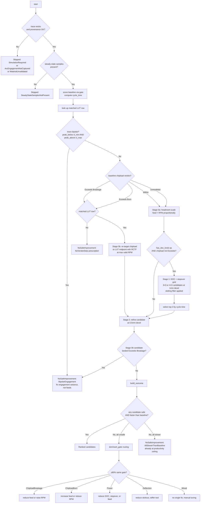

# Optimizer logic — decision flow

**Companion to** `OPTIMIZER_UX_PLAN.md` (which covers user journeys, data shapes, and search budgets). This doc is the *algorithmic* spec: decisions, branches, outcomes. Defines the logic in one place so we can refine it independently of any implementation, then audit the code against it.

## Contract

`optimize_toolpath(session, baseline_trace, toolpath_index, cancel) -> OptimizeOutcome`

**Inputs:**
- `baseline_trace` — the sim already on screen
- `toolpath_index` — which TP to tune
- `cancel` — cooperative cancel flag

**Promises:**
- The session's `(operation, dressups, face_selection, feeds_auto)` is restored on every exit path (Ok, refusal, cancel, panic).
- Every reported candidate's `cycle_time_s` and `verdict` come from a fresh sim of that candidate's params (no second model).
- `OptimizeOutcome::Ranked[0]` is always the baseline; subsequent rows sorted ascending by cycle time.

## Two layers of chipload

Cribbed from `research/feeds_and_speeds_integration_plan.md` §8 and `crates/rs_cam_core/src/feeds/geometry.rs::radial_chip_thinning_factor`. The optimizer must respect both layers — failing to do so is exactly what produced wanaka's burn-risk re-target.

| Layer | What it is | Where it lives | Bound |
|---|---|---|---|
| **Nominal chipload** | `feed ÷ (RPM × flutes)` — programmed, slot-equivalent | Toolpath authoring (`OperationConfig.feed_rate`, `spindle_rpm`) | The slot-engagement worst case |
| **Effective chipload** | leading-edge chip thickness, accounting for radial engagement | Per-sample by simulator (`SimulationCutSample.effective_chip_thickness_mm`) | What the LUT `[cl_min, cl_max]` actually bounds |

The bridge: `RCTF(ae, D) = 1 / sqrt(1 - (1 - 2·ae/D)²)`

| Engagement | RCTF | Effective vs nominal |
|---|---|---|
| Slot (`ae = D`) | 1.0 | effective = nominal |
| Half (`ae = 0.5·D`) | 1.0 | effective = nominal |
| Light (`ae = 0.14·D`, e.g. wanaka 0.84mm/6mm) | 1.44 | effective ≈ 0.69 × nominal |
| Air (`ae = 0`) | ∞ | effective = 0 |

**Auto-feeds compensates by boosting feed** so effective chipload at the *commanded* `ae` matches the LUT target (`feeds/mod.rs:300`: `feed = rpm × cl × flutes × chip_thinning`). The optimizer is post-sim and observes a *distribution* of actual `ae` across the trace — wider than commanded for variable-engagement ops.

**Implication for re-target:** when the baseline already uses RCTF compensation, "drop nominal to LUT midpoint" without RCTF would over-compensate (effective falls below `cl_min` at partial-engagement samples — burn risk). The re-target must apply the same RCTF the auto-feeds calculator did, anchored at the operation's *commanded* radial engagement.

**Implication for variance:** if the trace's actual `ae` distribution is wide (slot peaks AND partial-engagement runs), no single `(feed, RPM)` puts effective chipload inside `[cl_min, cl_max]` everywhere. That's the **bipolar** condition — refuse rather than ship a candidate that's wrong on one tail.

## Decision flow



## Decision nodes — semantics

### B. Provenance gate

Refuse early when the inputs the gate needs aren't present. Same set of `Verdict::Unmodeled` reasons the chipload/power gates surface — the optimizer can't be more confident than the gate.

| Trip | Outcome |
|---|---|
| `sim_trace == None` | `Skipped(SimulationRequired)` |
| no per-sample arc engagement | `Skipped(ArcEngagementNotCaptured)` |
| material is `Custom { kc: None }` | `Skipped(MaterialUnvalidated)` |

### C. Steady-state filter

The trace must contain at least one sample where:
- `is_cutting == true`
- `radial_engagement >= 0.02`
- `feed_rate >= 95% × commanded feed` (Item C steady-state filter from `chipload.rs`)

Drill cycles, all-plunge ops, and pure-rapid runs trip here → `Skipped(SteadyStateSamplesNotPresent)`.

### F0. Bipolar pre-check

Before branching on the chipload verdict, scan the trace for the bipolar condition. The chipload gate already computes `peak_below_chipload` and `peak_above_chipload` internally (`chipload.rs:186-187`); expose them or recompute over the steady-state sample set.

**Predicate:**

```
bipolar = exists steady-state sample S_low with effective_chip_thickness < cl_min
       && exists steady-state sample S_high with effective_chip_thickness > cl_max
```

When true → short-circuit to `NoSafeImprovement(BipolarEngagement)`. This catches the case **before** Stage 0 burns a sim on a candidate that can't possibly land Within. Wanaka's Back Rough trips this: peak chipload 0.0875 (above cap) coexists with low-engagement samples that would fall below floor at any safe nominal.

The gate's verdict alone isn't enough — it returns `Exceeds(Breakage)` *or* `Exceeds(Burn)` (priority order, breakage wins) but not both. The optimizer needs the underlying sample-counts.

**Why before F:** if we let F→H→I run on a bipolar baseline, Stage 0b emits a candidate that fixes one tail and breaks the other. The user gets a Burn prescription when the actual fix is "reduce engagement variance." Better to refuse upfront.

**Op-aware prescription wording.** "Reduce engagement variance" is actionable for ops where the user controls engagement — adaptive3d (stepover, stock-to-leave, model smoothing), pocket, adaptive. For ops where engagement is determined by geometry (project_curve, scallop, trace, drill cycles) the user has no direct lever. The prescription string therefore branches on `OperationType`:

| Op family | Prescription |
|---|---|
| Adaptive3d, Pocket, Adaptive, Rest, Face | "Engagement varies too widely for a single feed/RPM. Reduce variance via stepover, stock-to-leave, or smoothing the input geometry." |
| Project_curve, Scallop, Trace, Drill, Engrave, V-carve | "Engagement is determined by geometry for this op type and exceeds what the LUT can model with a single feed/RPM. Switch to adaptive3d for variable-engagement geometry, or accept the gate warning." |

Every refusal must point at a knob the user actually has. Vague prescriptions erode trust: a user told to "reduce variance" on a project_curve will adjust unrelated params, get worse results, and stop trusting the optimizer.

### F. Baseline chipload branch

Reached only when the trace is **not** bipolar. Each baseline verdict drives a different Stage-0 strategy:

| Baseline | Stage 0 strategy | Stage 1? | Why |
|---|---|---|---|
| `Within` | **Headroom-scale up.** Multiply feed and RPM by `k = min(machine_rpm, machine_feed, power, lut_row_rpm)/baseline`. Constant chipload. | Yes | Baseline is safe; we want productivity |
| `Exceeds(Breakage)` (peak above `cl_max`, no peak below `cl_min`) | **Re-target with RCTF.** Pick `(feed, rpm)` so effective chipload at commanded `ae` lands at LUT midpoint. Feed *drops*. | **No** | Stage 1 can't change chipload (it's `feed÷(rpm×flutes)`, invariant to DOC/stepover). |
| `Exceeds(Burn)` (peak below `cl_min`, no peak above `cl_max`) | Same re-target. Feed *rises* — symmetric. | **No** | Same reason. |
| `Unmodeled` | Try Stage 0 headroom anyway (no chipload to violate). Stage 1 runs. | Yes | The gate doesn't have an opinion; the optimizer can still scale safely up to other limits. |

(`Exceeds(Bipolar)` was caught in node F0.)

### H. LUT row availability for re-target

Re-target needs a calibrated `chip_load_mm` (midpoint), an RPM bracket, and the operation's commanded `ae` for RCTF. Without an LUT row:
- We don't know what chipload to target.
- We don't know what RPM range is calibrated.

Refuse with `NoVendorData` rather than guess. (The headroom path can run without an LUT row because it doesn't need the calibration — it just scales until something binds.)

### I. Stage 0b — re-target with RCTF

Algorithm:

```
// Pick effective-chipload target. Use midpoint when both bounds known;
// back off from cl_max when only the upper bound is published.
target_chipload_eff = match (matched_row.chip_load_min_mm, matched_row.chip_load_max_mm) {
    (Some(lo), Some(hi)) => (lo + hi) / 2,           // midpoint
    (None,     Some(hi)) => hi * 0.7,                // single-bound safety margin
    (Some(lo), None)     => lo * 1.3,                // symmetric, rare
    (None,     None)     => return None,             // unreachable in practice
}

ae                  = operation.stepover                       // commanded, not trace-observed
rctf                = radial_chip_thinning_factor(ae, tool.diameter())
target_chipload_nom = target_chipload_eff × rctf               // boost so effective lands at midpoint

rpm_lo              = max(machine_rpm_min, lut_row.rpm_min)
rpm_hi              = min(machine_rpm_max, lut_row.rpm_max ?? lut_row.rpm_nominal × 1.2)
rpm_for_max_feed    = machine_feed_max / (target_chipload_nom × flutes)
target_rpm          = clamp(rpm_hi, rpm_lo, rpm_for_max_feed)
target_feed         = target_chipload_nom × target_rpm × flutes

if abs(target_feed - baseline.feed_rate) > 0.10 × baseline.feed_rate {
    target_plunge = material.plunge_fraction × target_feed
}
```

**Single-bound fallback: `0.7 × cl_max`.** When only `cl_max` is published, the row's "midpoint" returned by `vendor_lookup::chipload_midpoint` collapses to that single value — the breakage cliff. Targeting it exactly leaves zero margin for sim noise (~5%), the LUT's calibration uncertainty, or engagement variance. Backing off to 70% of `cl_max` gives real safety while still well above formula-fallback levels.

**RCTF anchors at commanded `ae`, not trace-observed engagement.** This matches the auto-feeds calculator (`feeds/mod.rs:286`) — the optimizer's recommendation is independent of prior sim quality, so the same op produces the same candidate regardless of whether the prior trace was 1mm or 0.5mm dexel. Trace-observed engagement is the *gate's* input for verifying the candidate; the optimizer's job is just to pick a stable target.

**Productivity policy: max RPM, capped by feed.** Once we're already changing params, take the productivity that comes with higher RPM (MRR scales linearly with RPM at constant chipload). The LUT row's `rpm_max` is the calibration ceiling; going past it extrapolates beyond vendor data. Above `rpm_for_max_feed`, RPM would force feed past the machine cap and chipload would underflow — drop RPM to honour the chipload target instead.

**Plunge rate updates with feed.** When feed changes by more than 10% of baseline, recompute plunge as `material.plunge_fraction × new_feed`. Otherwise the user gets a candidate with mismatched feed/plunge ratio and the gate's plunge-derate logic mis-fires.

### J. Stage 1 gate

Skip Stage 1 when:
- The op has no `depth_per_pass` knob (Project Curve, Drill, Trace, V-Carve)
- **OR** the baseline chipload is `Exceeds` (any non-bipolar reason)

Stage 1's grid (`build_doc_variants`, `build_stepover_variants`) should also apply the **slotting filter**: skip variants where `stepover > 0.85 × tool_diameter` (per `feeds/mod.rs:262`) — those configurations force DOC down for safety and don't represent useful candidates. The reference's calculator already prevents this composition; Stage 1 should inherit the same constraint.

### K_soft. Soft bipolar trip

After Stage 2 refinement, if Stage 0b's re-target candidate landed `Exceeds(Breakage)` despite targeting effective midpoint, that's a sign the trace had hidden engagement variance the F0 pre-check didn't catch (e.g., the baseline was *only* Burn but the re-target's higher feed pushed slot moments into Breakage). Surface as `BipolarEngagement` rather than continuing.

### N + O. Outcome dispatch

```
empty candidates                                    → NoSafeImprovement(NoImprovementFound)
some candidate is safe AND faster than baseline+0.5s → Ranked
all candidates safe but none faster                  → NoSafeImprovement(AllSlowerThanBaseline)
all candidates unsafe                                → NoSafeImprovement + dominant_gate prescription
```

### P + Q. Dominant gate routing

When all candidates fail the gate, find the gate that ≥80% of them tripped. Emit a typed prescription. Below the dominance threshold → `Mixed`.

| Dominator | Prescription |
|---|---|
| ChiploadBreakage | reduce feed or raise RPM |
| ChiploadBurn | increase feed or reduce RPM |
| Power | reduce DOC, stepover, or feed |
| Deflection | reduce stickout or use a stiffer tool |
| Mixed | no single fix — manual tuning |

The prescription is the user's actionable next step. It's typed by the gate, not free-form English, so the rendering surface (toast, modal, rollup) gets the same string structure.

## Cross-cutting principles

These hold at every node and aren't a single flow position.

### 1. Sim is the only oracle for verdict

Every reported candidate carries a sim-measured cycle_time and a gate verdict over the same sim. No second chipload model anywhere. (`OPTIMIZER_UX_PLAN.md` Engineering Default 1.)

**Implication: no analytical short-circuits for power.** When chipload is Within but power Exceeds, Stage 1's empirical DOC × stepover sweep is what finds a fix — slowly, but every candidate is sim-verified. An analytical "Stage 0c" power solve was considered and rejected: closed-form power formulas approximate engagement, stock state, and cutting dynamics that only the simulator gets right. We pay sim cost to keep verdicts trustworthy.

### 2. Effective chipload bounds the LUT, nominal bounds the user-facing knob

When this doc says "target X chipload," X is **effective** (what the LUT bounds). The optimizer translates to nominal via RCTF. Users in the modal see nominal feed and RPM (because that's what the machine takes); the optimizer's prescription strings reference the user-facing knobs ("reduce feed").

### 3. RPM ceiling is the LUT row's calibrated max, not the machine's

Going past `rpm_max` or `rpm_nominal × 1.2` extrapolates beyond vendor data. The chipload bands' validity is tied to the RPM bracket; outside it, the LUT can't tell you whether 0.05 mm/tooth is safe.

### 4. Plunge tracks feed

Big feed changes need matching plunge changes — the auto-feeds pipeline derives plunge from material × feed. The optimizer mutates `op.feed_rate` directly today; it should also mutate `op.plunge_rate` whenever feed delta > 10%.

### 5. Slotting precludes Stage 1 candidates

Variants where `stepover > 0.85 × D` aren't real options — the reference's calculator forces DOC down in that regime, breaking the `(DOC, stepover)` independence Stage 1 assumes. Filter them out before sim.

### 6. One candidate per Stage-0 path; refusal beats pseudo-fix

Stage 0 emits at most one candidate (either headroom-up *or* re-target). For bipolar baselines, a "menu" of two candidates (one biased toward burn, one toward breakage) was considered and rejected: each candidate fails on a different tail, and the user has to pick without understanding the trade-off. Honest refusal — "this is a generator-level problem, not a feeds problem" — is more reliable than a chooser of half-fixes.

### 7. Every refusal points at a knob the user has

Generic prescriptions ("reduce engagement variance") that don't map to the user's op type erode trust. Refusal strings branch on `OperationType` so the lever name in the prescription is one the user can actually turn (see Node F0). When no lever exists for a given op, say so explicitly ("switch op type or accept the warning") rather than handing out advice that won't work.

## Gaps between this spec and current code

As of 2026-05-04 (post-master). Prioritised — top rows are biggest user-visible wins.

| # | Spec node | Current code | Fix scope |
|---|---|---|---|
| 1 | **F0** Bipolar pre-check before any candidate generation | ✅ Landed 2026-05-04. `chipload::detect_bipolar` reads steady-state samples and counts above/below LUT bounds; ≥3 on each side trips. Wired as F0 between LUT lookup and Stage 0. | done |
| 2 | **I** RCTF compensation in re-target | ✅ Landed 2026-05-04. `solve_chipload_downshift` now takes `stepover_mm` + `tool_diameter_mm` and multiplies the effective-chipload target by `radial_chip_thinning_factor(stepover, D)` to compute the nominal target. | done |
| 3 | **F0** Op-aware bipolar prescription | ✅ Landed 2026-05-04. `prescription_for_bipolar(OperationType)` partitions the same set as `has_doc_knob` — adaptive-family ops get lever advice, geometry-fixed ops get switch-op advice. | done |
| 4 | **I** Single-bound LUT row safety margin | ✅ Landed 2026-05-04. `solve_chipload_downshift` now uses a four-arm match on `(chip_load_min_mm, chip_load_max_mm)`: midpoint when both, `0.7 × cl_max` when only upper, `1.3 × cl_min` when only lower, `None` when neither. | done |
| 5 | **I** Plunge rate updates with feed | ✅ Landed 2026-05-04. `apply_downshift_to_op` takes `material: &Material`. When the feed change exceeds 10% of baseline, plunge scales proportionally to preserve the user's feed/plunge ratio, capped at `material.plunge_rate_base() × machine.safety_factor`. | done |
| 6 | **K_soft** Soft bipolar after Stage 2 | ✅ Landed 2026-05-04. `soft_bipolar_detected(baseline, candidates)` returns true when any candidate's chipload Exceeds is in the opposite direction from baseline. Wired between `refine_stage2` and `build_outcome` to short-circuit with `BipolarEngagement` instead of regular dominant-gate prescription. | done |
| 7 | **L** Slotting filter on Stage 1 grid | ✅ Landed 2026-05-04. `is_slotting_variant(stepover, diameter)` returns true when `stepover > 0.85 × D`. Stage 1's inner loop continues past slotting variants — saves a sim per skipped variant and keeps the (DOC, stepover) independence Stage 1 assumes. | done |
| 8 | **F → re-target** naming | ✅ Landed 2026-05-04. `solve_chipload_downshift` → `solve_chipload_retarget`. `apply_downshift_to_op` → `apply_retarget_to_op`. Doc comments and test names follow. | done |

**Status:** all 8 gaps closed as of 2026-05-04. Phase 1 (gaps 1, 2, 3) verified live on wanaka — Back Rough returns `BipolarEngagement` with op-aware prescription, no Stage 0b run, no misleading burn-risk pseudo-fix. Phases 2 and 3 are unit-tested only (their surface doesn't appear on wanaka — Amana hardwood rows are double-bound and bipolar short-circuits before Stage 2).

## Implementation plan

Three phases. Each phase ends in a clean commit + a live wanaka MCP verification step. Total: ~115 LOC + ~12 tests, plus mechanical rename and small polish.

### Phase 1 — Bipolar safety (gaps 1, 2, 3)

**Outcome:** wanaka Back Rough returns `NoSafeImprovement(BipolarEngagement)` with an op-aware prescription. Non-bipolar baselines get a sim-verifiable Within candidate from the corrected re-target.

**Order within phase** (each is a separate commit):

1. **Gap 3 first — the prescription helper.** No new callers yet, just the pure function and its tests. Lets us land + test in isolation before wiring.
   - File: `crates/rs_cam_core/src/tool_load/optimize.rs`
   - Add: `fn prescription_for_bipolar(op_kind: OperationType) -> &'static str`
   - Two arms: adaptive-family ops (Adaptive3d, Pocket, Adaptive, Rest, Face) → "reduce variance via stepover, stock-to-leave, or smoothing"; geometry-fixed ops (ProjectCurve, Scallop, Trace, Drill, Engrave, V-carve) → "switch to adaptive3d or accept the gate warning"
   - Tests: each op-kind variant routes to the right string

2. **Gap 1 — bipolar predicate + wire-in.** Implements F0.
   - File: `crates/rs_cam_core/src/tool_load/optimize.rs` and possibly a new helper in `chipload.rs`
   - Add: `fn detect_bipolar(trace, toolpath_id, lut_row, op_feed_rate, op_kind) -> bool`. Iterates the steady-state sample set (same filter as `chipload::evaluate`) and counts samples below `cl_min` and above `cl_max`. Returns true iff both counts ≥ N (start with N=3; less is sim noise).
   - Wire into `optimize_toolpath` between line 358 (LUT lookup) and line 362 (chipload-exceeds check). When true, return `NoSafeImprovement(BipolarEngagement)` with `prescription_for_bipolar(ctx.operation_kind)` as the explanation.
   - Tests: synthetic trace with 5 samples below floor + 5 above cap → bipolar; uniform-engagement trace → not bipolar; boundary case (N-1 samples one side, N the other) → not bipolar
   - **Refactor opportunity:** extract the steady-state filter from `chipload::evaluate` into a shared `steady_state_samples_for_toolpath(...)` so the gate and bipolar detector use the same filter. Saves duplicated filter logic. ~20 LOC refactor, no behaviour change.

3. **Gap 2 — RCTF compensation in re-target.** Independent of Gaps 1+3 mechanically; parallel-safe with them.
   - File: `crates/rs_cam_core/src/tool_load/optimize.rs`
   - Modify: `solve_chipload_downshift` signature to take `stepover_mm: f64, tool_diameter: f64` (or read them from `ctx`). Multiply `target_chipload` by `feeds::geometry::radial_chip_thinning_factor(stepover, diameter)`.
   - Caller (`optimize_toolpath` line ~370) passes `op.stepover().unwrap_or(...)` and `ctx.tool.diameter()`.
   - Tests:
     - Wanaka shape (D=6, stepover=0.84, midpoint=0.05): target nominal chipload = 0.05 × 1.44 ≈ 0.072 (boost visible)
     - Slot case (stepover=D, RCTF=1.0): target unchanged from midpoint (regression test)
   - Existing tests (`downshift_targets_row_midpoint_at_max_rpm` etc.) need updating — the expected numbers change once RCTF is in. Bake the new expected values from the formula.

**Phase 1 verification (live MCP):**

```
load wanaka_full_tuned.toml
generate Back Rough
run sim
optimize_toolpath(1)
```
Expected: `NoSafeImprovement` with `BipolarEngagement`, explanation contains "reduce variance via stepover, stock-to-leave, or smoothing." `attempted` length is 1 (baseline only) — Stage 0b never ran.

Plus a non-bipolar TP (e.g., a Pocket op on a different project) to confirm Stage 0b still produces a Ranked candidate at the corrected RCTF target.

### Phase 2 — Edge-of-cliff and consistency (gaps 4, 5)

**Outcome:** single-bound LUT rows stop landing chipload on the cap. Big feed changes update plunge rate to match.

Independent commits, can be parallel:

4. **Gap 4 — single-bound LUT safety margin.**
   - File: `crates/rs_cam_core/src/tool_load/optimize.rs` (`solve_chipload_downshift`, after Gap 2 lands)
   - Replace `target_chipload = matched_row.chip_load_mm` with the four-arm match on `(chip_load_min_mm, chip_load_max_mm)`:
     ```
     (Some(lo), Some(hi)) => (lo + hi) / 2
     (None,     Some(hi)) => hi * 0.7
     (Some(lo), None)     => lo * 1.3
     (None,     None)     => return None
     ```
   - Tests: each arm produces the right target; double-bound case is unchanged from current behaviour (regression).

5. **Gap 5 — plunge tracks feed.**
   - File: `crates/rs_cam_core/src/tool_load/optimize.rs` (`apply_downshift_to_op`, also rename per Gap 8 if landing together)
   - Take an additional `material: &Material` param. After writing `feed_rate` and `spindle_rpm`, if `(new_feed - baseline_feed).abs() / baseline_feed > 0.10`:
     - new plunge = `material.plunge_rate_base() * (new_feed / typical_op_feed)` — or simpler, lift the recipe from `feeds::calculate` line 357
   - Update one call site in `optimize_toolpath` to pass material.
   - Test: synthetic baseline at 3000 mm/min, downshift to 1500, plunge halves (or tracks per recipe). No-change case (within 10%) leaves plunge alone.

**Phase 2 verification:** unit tests only — wanaka doesn't exercise single-bound rows (Amana hardwood entries are all double-bound). Synthetic LUT row in test gives coverage.

### Phase 3 — Polish (gaps 6, 7, 8)

**Outcome:** soft-bipolar trips post-Stage-2 don't slip through. Stage 1 grid drops slotting variants. Function name matches its role.

Independent, any order:

6. **Gap 6 — K_soft soft bipolar after Stage 2.**
   - File: `crates/rs_cam_core/src/tool_load/optimize.rs` between `refine_stage2` return and `build_outcome` (line ~480)
   - Predicate: `baseline_chipload_was = match baseline_verdict.chipload { Exceeds { reason: ChiploadBurnRisk, .. } => Some(Burn), Exceeds { reason: ChiploadBreakageRisk, .. } => Some(Breakage), _ => None }`. After Stage 2, scan the candidates: if any has `chipload: Exceeds(opposite_direction)` → soft bipolar, return `NoSafeImprovement(BipolarEngagement)`.
   - Test: synthetic candidate that flips Burn→Breakage triggers refusal.

7. **Gap 7 — slotting filter on Stage 1.**
   - File: `crates/rs_cam_core/src/tool_load/optimize.rs` line ~437 (the inner `for &stepover in &stepover_variants` loop)
   - Add: `if stepover > 0.85 * tool_diameter { continue; }` before the candidate evaluation
   - Test: Stage 1 grid with `stepover > 0.85*D` skips that variant; grid with all stepovers ≤ 0.85*D unchanged.

8. **Gap 8 — rename `solve_chipload_downshift` → `solve_chipload_retarget`.**
   - Mechanical. Includes `apply_downshift_to_op` → `apply_retarget_to_op` and the inline comment on line 359 ("Stage 0b") in `optimize_toolpath`.
   - Run `cargo check` to catch any external callers (none expected; functions are `pub(crate)`).

**Phase 3 verification:** unit tests + cargo test --workspace passes.

## Dependencies and risks

| Risk | Mitigation |
|---|---|
| Bipolar predicate trips on sim noise (single stray sample) | Require ≥3 samples on each side; tunable constant |
| RCTF compensation breaks existing tests for non-bipolar baselines | Update expected values from the formula in the same commit; the math is closed-form, not heuristic |
| Refactoring steady-state filter destabilises `chipload::evaluate` | Land the refactor as its own no-behaviour-change commit before Gap 1 wires it |
| Plunge-rate update over-aggressive on small feed changes | Hysteresis (10% threshold) — same convention as `feeds_auto` flags |
| Soft-bipolar in Phase 3 supersedes Phase 1 detection unexpectedly | Soft-bipolar runs after Stage 2 only when Phase 1's pre-check missed; both refusals route to the same `BipolarEngagement` reason so the user sees consistent prescriptions |

## Total scope

| Phase | LOC | Tests | Commits |
|---|---|---|---|
| 1 (bipolar safety) | ~50 | 6 | 3 (or 4 with refactor) |
| 2 (edge-of-cliff) | ~30 | 3 | 2 |
| 3 (polish) | ~30 | 3 | 3 |
| **Total** | **~115** | **~12** | **8** |

Phase 1 is the only one that changes user-visible optimizer behaviour for current projects. Phases 2 and 3 are quality plumbing that affects edge cases or tooling consistency.

## Resolved decisions

These started as open questions during the 2026-05-04 review. Calls were made for **reliability and accuracy** over breadth/speed:

| Q | Question | Decision | Rationale |
|---|---|---|---|
| 1 | Bipolar prescription wording for non-adaptive ops | **Two strings, op-aware** (Node F0) | Vague advice on ops where the user can't change engagement erodes trust |
| 2 | Should Stage 0 emit multiple candidates? | **Single candidate; refuse rather than menu** (Cross-cutting #6) | A chooser of half-fixes obscures that none of them are right |
| 3 | Power-cap analytical Stage 0c | **No — Stage 1 empirical only** (Cross-cutting #1) | Sim is the only oracle; analytical projections re-introduce the model drift that caused `peak_chipload` to go bad |
| 4 | RCTF ae anchor: commanded vs trace-observed | **Commanded** (Node I) | Trace-observed creates a feedback loop on prior sim quality; commanded is stable input for stable output |
| 5 | LUT row with only `cl_max` published | **Target `0.7 × cl_max`, not the cap** (Node I) | Sitting on the breakage cliff with no margin for sim noise + calibration uncertainty + engagement variance is asking for it |

**The thread through these:** prefer honest refusal over false fixes (1, 2), measured verdicts over predicted ones (3), stable inputs over drift-prone (4), margin over edge-of-cliff targets (5).

## Remaining open questions

None as of 2026-05-04. New questions go here when they come up.

## How to use this doc

When proposing an optimizer change:

1. State which decision node the change touches (e.g., "node F0, the bipolar pre-check").
2. Update the diagram + the corresponding section.
3. Note the gap row (move the row out of "Gaps" once code lands).

The diagram is the source of truth for "what should happen." The Gaps table is the audit log against the implementation. Open questions are explicit unsettled design calls — promote them to spec when resolved.
